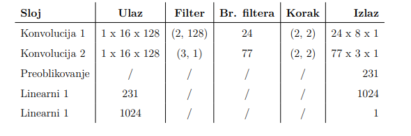
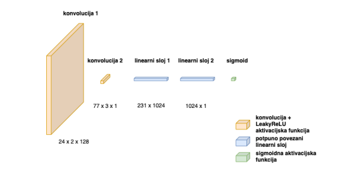
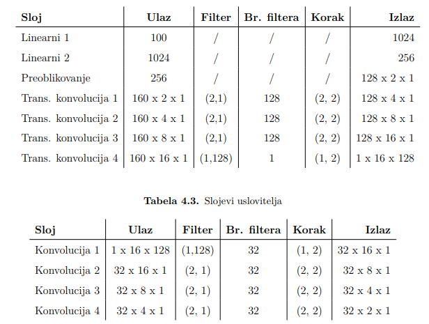
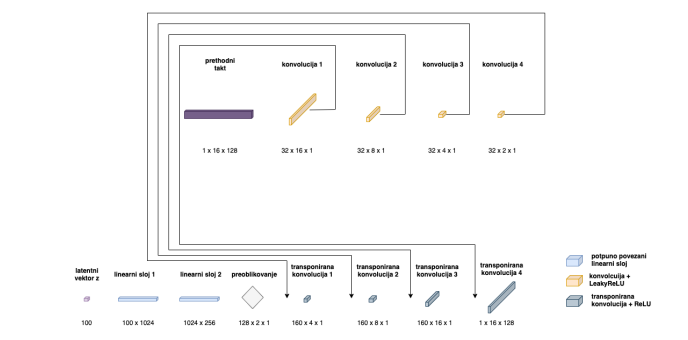
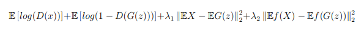

# MidiNet in PyTorch

This repository contains source code of my bachelor thesis **"Generating music with convolutional GAN networks"**. In the thesis, I reviewed different ways of generating music in CS and then focused on explaining and implementing the [MidiNet](https://github.com/RichardYang40148/MidiNet/tree/master/v1) network.

## Overview

 The idea behind the MidiNet is that music in MIDI format transforms to piano roll format which enables us to look at music from a geometric view
that is that we look at music like an array of two-dimensional matrices, where every term of the array corresponds to a MIDI track. For sake of simplicity, only one track will be processed that is we will process only one instrument from the original MIDI file, usually the track containing the main melody. Then, the piano roll representation is split into bars. Finally, the output of these steps is being fed into the DCGAN model with the goal of training the model. What is specific about this model is the fact that besides the generator and discriminator (which are the basis of the GAN model) there is a third component involved which we call the conditioner. The conditioner's role is to extract features from the previous bar and to condition the generator so that the current generated bar is influenced by the previous bar. This implementation is not identical to the implementation of the authors of MidiNet, instead, it was driven by the best results I was achieving while researching.
## Data preprocessing
The process of converting a MIDI file into the piano roll format is done with [pypianoroll](https://salu133445.github.io/pypianoroll/). First, we load the MIDI file into the *Multitrack* object and then depending on the MIDI file we select the desired track (usually the one containting the main melody or guitar riffs). On the selected track we set temporal resolution (number of bits on quarternote) and we binarize the track. Binarization is the process in which we round all the velocities in the MIDI messages, resulting in a MIDI track with all velocities equal either to 1 or to 0. The result of that operation is a binary matrix with the dimension of *hxw* where h is 128 and w is dependent on the number of bars of the MIDI file. Values in the range 0-127 map MIDI notes numbers and the value 128 is used for representing silence. This representation we split into bars that is the matrix *hxw* is being split into submatrices of dimension *hx16*. The value 16 is being chosen because we assume that the files being processed are in the 4/4 measure, that is one bar contains 4 quarter notes.  As the shortes note we are observing is a sixteenth note, 16 sixteenth notes results precisely in one 4/4 bar. Depending on the MIDI track we are processing, we take a certain amount of bars and convert it to a [numpy](https://numpy.org/doc/stable/index.html) array. The resulting array we copy and shift for one into right so we get a represenation of previous bars.

## Discriminator
The discriminator is implemented as a convolutional neuarl network (CNN) with two convolutional and two linear layers. As the activation function of convolutional layers LeakyReLu is used. The activation fucntion on the output is sigmoid.

Sloj = Layer, Ulaz = Input, Br. filtera = Number of filters, Korak = Step, Izlaz = Output

## Generator & Conditioner
We define the generator and conditioner withinn the same model because we need to train them with the same gradient. The idea behind the conditioner is to behave like the inverse image of the generator. During the generation of a bar we pass the generator random vector *z* (latent vector) and the previous bar, in case we are generating the first bar of a melody the previous bar is empty (silence). The previous bar goes through the conditioner, and every output of the conditioner's layers is being appended to the corresponding output layers of the generator. With this approach, we aim to encode the features from the previous bar into the currently generated bar.

The process is being repeated until all transposed convolutions are completed. On convolution layers of the conditioner LeakyReLu activation has been used while on the transposed convolutions of the generator ReLu activatio has been used. The big difference between number of filters in the conditioner and generator is because if we increase the number of filters of the conditioner we effectively increase the amount of the features being encoded into the currently generated bar. So if the number is too high, the newly generated bars will be too similiar to the previous one - killing the creativity.

## Loss fuction
The loss function is based on the GAN loss function with two additional terms. One is the mean squared error between the real bar and the generated bar in some iteration of learning. The second term also represents mean squared error but the error is computed from the output of the first convolution of the discriminator and the generated bar. Both terms are multiplied with parameters  λ1, and λ2, respectively. The parameters enable us to choose how much the generated bars should be familiar with the training set. It turned out that these parameters play a big role in the stabilization of the generator. Also, with the aim of preventing generator collapse, we update the parameters of the generator twice while we update the parameters of the discriminator once in each iteration.

## Results
You can listen to some results I got while training the model on metal, the Beatles and classical music. The recordings can be found on [souncloud](https://soundcloud.com/tylerdurden-9/sets/ai-generated-music).

